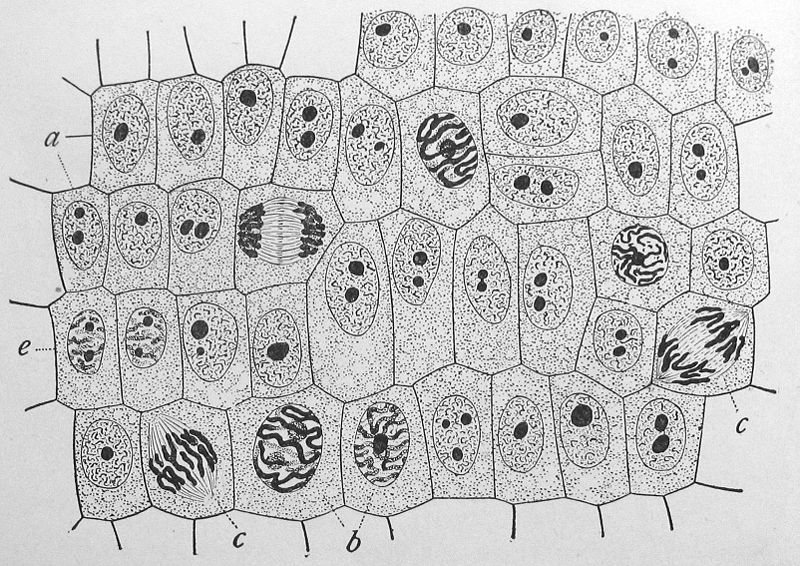
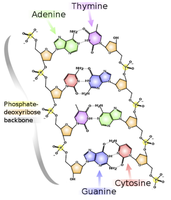

# Problem
A string is simply an ordered collection of symbols selected from some alphabet and formed into a word; the length of a string is the number of symbols that it contains.

An example of a length 21 DNA string (whose alphabet contains the symbols 'A', 'C', 'G', and 'T') is "ATGCTTCAGAAAGGTCTTACG."

Given: A DNA string s of length at most 1000 nt.

Return: Four integers (separated by spaces) counting the respective number of times that the symbols 'A', 'C', 'G', and 'T' occur in s.

### Sample Dataset
> AGCTTTTCATTCTGACTGCAACGGGCAATATGTCTCTGTGTGGATTAAAAAAAGAGTGTCTGATAGCAGC
### Sample Output
> 20 12 17 21

# Biological Background
## A Rapid Introduction to Molecular Biology

Making up all living material, the cell is considered to be the building block of life. The nucleus, a component of most eukaryotic cells, was identified as the hub of cellular activity 150 years ago. Viewed under a light microscope, the nucleus appears only as a darker region of the cell, but as we increase magnification, we find that the nucleus is densely filled with a stew of macromolecules called chromatin. During mitosis (eukaryotic cell division), most of the chromatin condenses into long, thin strings called chromosomes. See Figure 1 for a figure of cells in different stages of mitosis.

One class of the macromolecules contained in chromatin are called nucleic acids. Early 20th century research into the chemical identity of nucleic acids culminated with the conclusion that nucleic acids are polymers, or repeating chains of smaller, similarly structured molecules known as monomers. Because of their tendency to be long and thin, nucleic acid polymers are commonly called strands.

The nucleic acid monomer is called a nucleotide and is used as a unit of strand length (abbreviated to nt). Each nucleotide is formed of three parts: a sugar molecule, a negatively charged ion called a phosphate, and a compound called a nucleobase ("base" for short). Polymerization is achieved as the sugar of one nucleotide bonds to the phosphate of the next nucleotide in the chain, which forms a sugar-phosphate backbone for the nucleic acid strand. A key point is that the nucleotides of a specific type of nucleic acid always contain the same sugar and phosphate molecules, and they differ only in their choice of base. Thus, one strand of a nucleic acid can be differentiated from another based solely on the order of its bases; this ordering of bases defines a nucleic acid's primary structure.

For example, Figure 2 shows a strand of deoxyribose nucleic acid (DNA), in which the sugar is called deoxyribose, and the only four choices for nucleobases are molecules called adenine (A), cytosine (C), guanine (G), and thymine (T).

For reasons we will soon see, DNA is found in all living organisms on Earth, including bacteria; it is even found in many viruses (which are often considered to be nonliving). Because of its importance, we reserve the term genome to refer to the sum total of the DNA contained in an organism's chromosomes.

Figure 1. A 1900 drawing by Edmund Wilson of onion cells at different stages of mitosis. The sample has been dyed, causing chromatin in the cells (which soaks up the dye) to appear in greater contrast to the rest of the cell.

Figure 2. A sketch of DNA's primary structure.
